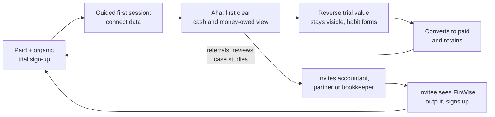

# The Bet · FinWise

> Module 1 · Ignite a PLG Motion. The growth hypothesis and where you're betting, plus the growth-loop visualization.

## Growth hypothesis

FinWise's biggest growth problem is that **trial users never reach value**, because **the reverse trial doesn't get them to a "my money is finally clear" moment before the paywall hits**. Only 2% of trials convert, and the 40% one-year retention of those who do suggests even the converters are not deeply hooked.

_Working notes:_ Paid acquisition feeds a leaky funnel at both ends, so more spend adds trials that fail the same way.

**Evidence:**
- 2% trial-to-paid is low for a reverse-trial motion, which is built to show premium value first. That points to a failure to deliver value, not a lack of demand.
- Spend on acquisition has stopped moving growth. This is the signature of a constraint downstream of acquisition.
- 60% annual churn means ~$6M of the $10M ARR base must be replaced each year just to stand still. Part of that churn is likely users who never fully activated and converted anyway.

**Against the data (what could prove this wrong):**
- Trial users may be low-intent (wrong ICP from paid channels), in which case the fix is targeting, not activation.
- Churn may be driven by small-business failure or seasonality, not product value.
- We don't yet have an activation-vs-conversion cut. If activated users also convert at ~2%, the problem is the paywall or price, not activation. _(Module 4 must check this.)_

---

## The bet

**Bet:** Redesign the first-session experience so that new trial users connect their financial data and see their first clear picture of cash position and what they owe or are owed, within their first session. Activation, not acquisition, becomes the growth lever for the next year.

**Why this and not retention or pricing first:** Activation sits upstream of both. Users who never reach value can't be retained, and pricing a product people haven't experienced won't raise conversion. Fixing it lifts trial conversion directly, and every later lever (habit, paywall, pricing) acts on a healthier funnel.

**Target (to be validated in Module 5):** raise trial-to-paid from 2% toward 4% within two quarters on the same trial volume. At constant volume, that doubles new-customer ARR with zero extra acquisition spend.

**Not doing:**
- Increasing paid acquisition budget (demonstrably saturated).
- Changing price or packaging before we know where the activation drop-off is (revisit in Module 6).
- Building net-new feature surface area. The value exists; users aren't reaching it.
- Broad retention programs for paid customers. Habit mechanics come after activation is fixed (Module 3).

---

## Growth loop

**Loop type:** Product-led activation loop, with a collaboration (viral) branch

**How it compounds:** Each activated user can invite an accountant or business partner, who experiences FinWise through real data and becomes a new, higher-intent trial sign-up. These sign-ups are free and arrive pre-qualified. As activation rises, the loop produces more trials without extra paid spend, which is the growth the saturated acquisition channel can no longer deliver.

_Assumption to confirm: that small-business owners routinely share financial data with an accountant or partner, which is the mechanic the collaboration branch depends on._

---
